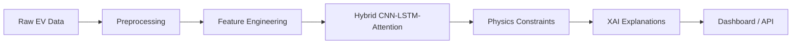
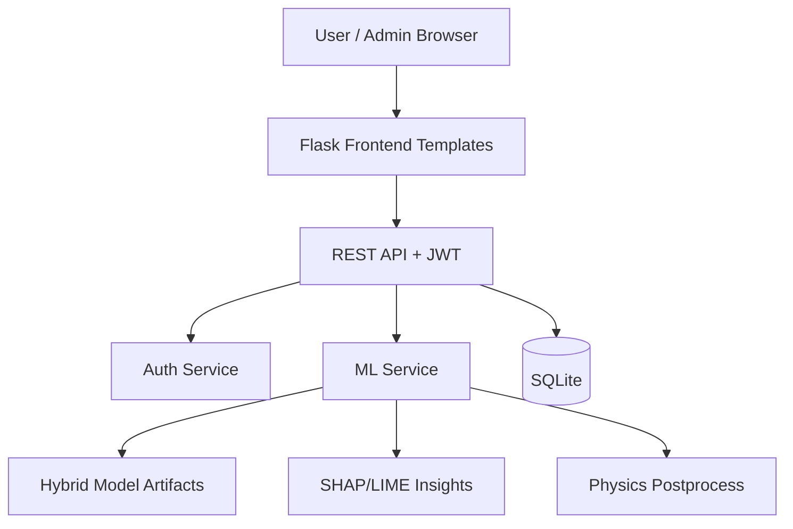
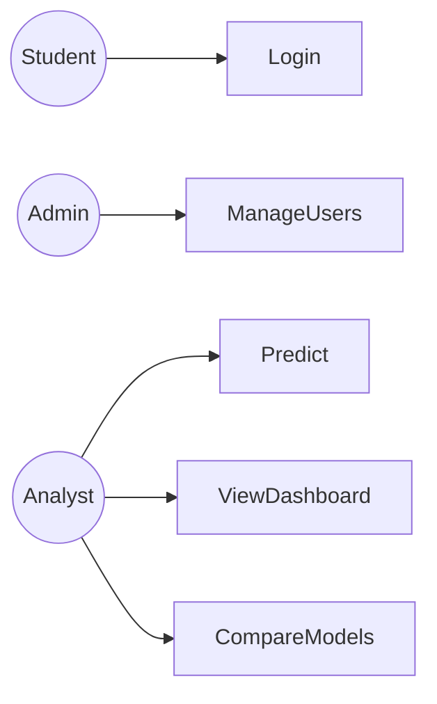
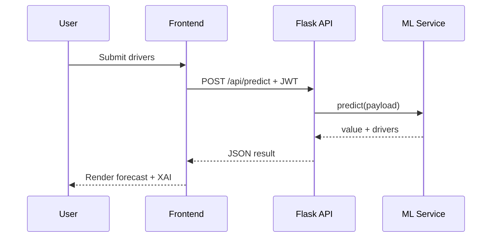
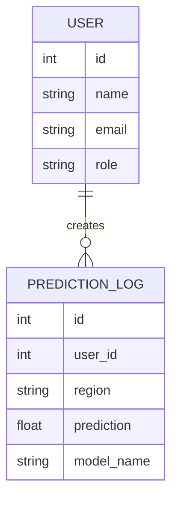

# System Diagrams (Mermaid)

## Workflow

```mermaid
flowchart LR
  A[Raw EV Data] --> B[Preprocessing]
  B --> C[Feature Engineering]
  C --> D[Hybrid CNN-LSTM-Attention]
  D --> E[Physics Constraints]
  E --> F[XAI Explanations]
  F --> G[Dashboard / API]
```

## System Architecture

```mermaid
flowchart TB
  U[User / Admin Browser] --> F[Flask Frontend Templates]
  F --> API[REST API + JWT]
  API --> AUTH[Auth Service]
  API --> MLS[ML Service]
  API --> DB[(SQLite)]
  MLS --> MODEL[Hybrid Model Artifacts]
  MLS --> XAI[SHAP/LIME Insights]
  MLS --> PHY[Physics Postprocess]
```

## Use Case

```mermaid
flowchart LR
  Student((Student)) --> Login
  Admin((Admin)) --> ManageUsers
  Analyst((Analyst)) --> Predict
  Analyst --> ViewDashboard
  Analyst --> CompareModels
```

## Sequence — Prediction

```mermaid
sequenceDiagram
  participant U as User
  participant UI as Frontend
  participant API as Flask API
  participant ML as ML Service
  U->>UI: Submit drivers
  UI->>API: POST /api/predict + JWT
  API->>ML: predict(payload)
  ML-->>API: value + drivers
  API-->>UI: JSON result
  UI-->>U: Render forecast + XAI
```

## ER Diagram

```mermaid
erDiagram
  USER ||--o{ PREDICTION_LOG : creates
  USER {
    int id
    string name
    string email
    string role
  }
  PREDICTION_LOG {
    int id
    int user_id
    string region
    float prediction
    string model_name
  }
```

## Deployment

```mermaid
flowchart LR
  Dev[VS Code / Jupyter] --> Repo[Project Repo]
  Repo --> Server[Flask App :5000]
  Server --> Disk[models/saved + SQLite]
```
